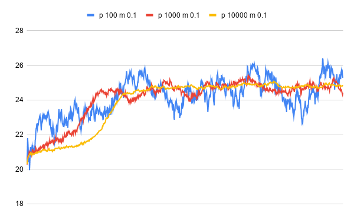
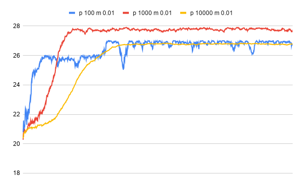
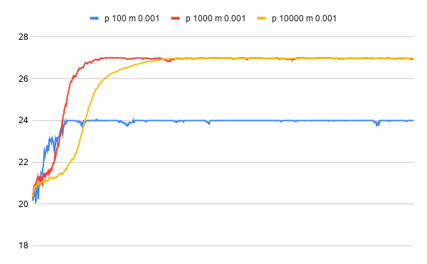
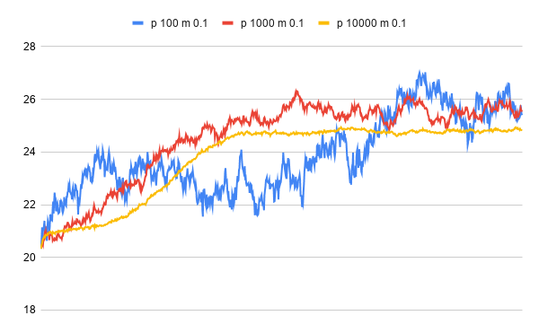
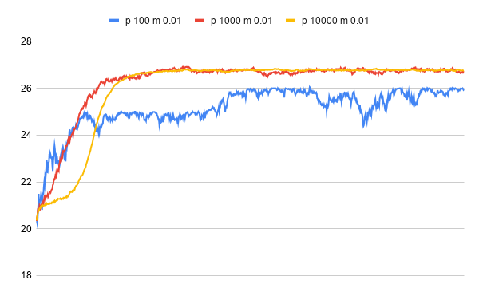
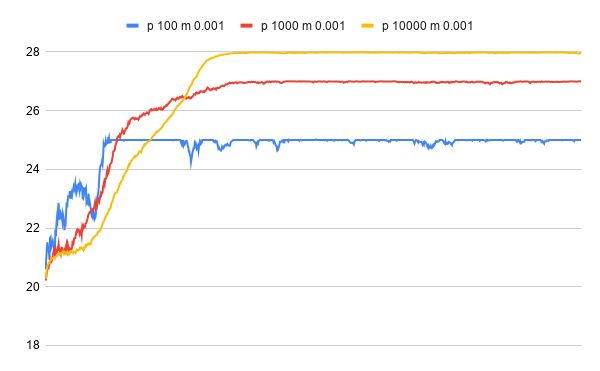

# Setup
`git clone -url-`

`cd queenspuzzle`

`stack run > out.txt`

(Be sure to install [stack](https://docs.haskellstack.org/en/stable/README/) beforehand!)

# Results (1000 generations)
## Run 1

Full data can be seen in [outfinal.txt](outfinal.txt)

## Run 2

Full data can be seen in [outfinal2.txt](outfinal2.txt)

# Conclusions

## Population size

One interpretation of these data would be that increasing the population size increases the "mass" of the population in that it makes the trend more resistant to change. In the low population size trials, the average fitness fluctuates wildly across the whole graph even when the mutation rate is low. This ability to drastically change allows the population to rapidly increase its fitness initially, but it also means the population has a hard time maintaining that high fitness. High population size trials take longer to reach their maximum fitness, but they maintain that fitness much more reliably. 

## Mutation rate

Whereas population size influences the general shape of the graph, mutation rate influences variation on a local scale. When the mutation rate is high, a population's fitness could change drastically in just one or two generations. This allows new genes to enter the gene pool, but it can also lower fitness by changing already high-fitness genes.

## Initial population

Results vary highly depending on the initial population. Even when given the same population size and mutation parameters, trials may still plateau at different fitness values. This is due to the fact that the initial population is the only source of genetic information in the algorithm aside from mutation rate. For example, if the initial population consisted entirely of the same gene, a new gene with a higher fitness would never be produced unless by mutation. In the case of a plateauing homogenous population as seen in run 2 graph 3, it's unlikely that any single mutation would increase fitness instead of decreasing it.